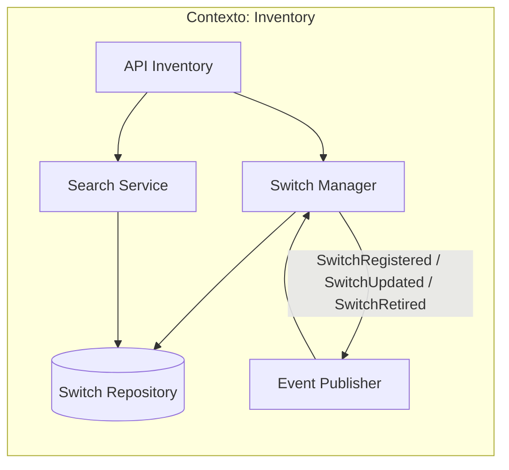
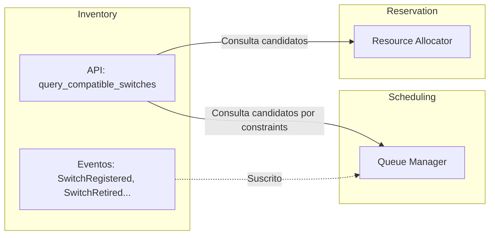
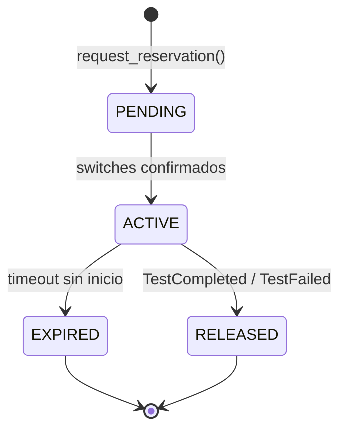
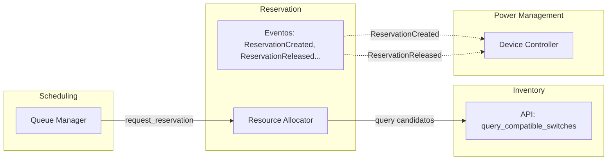
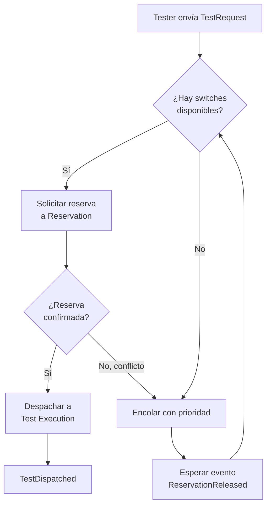
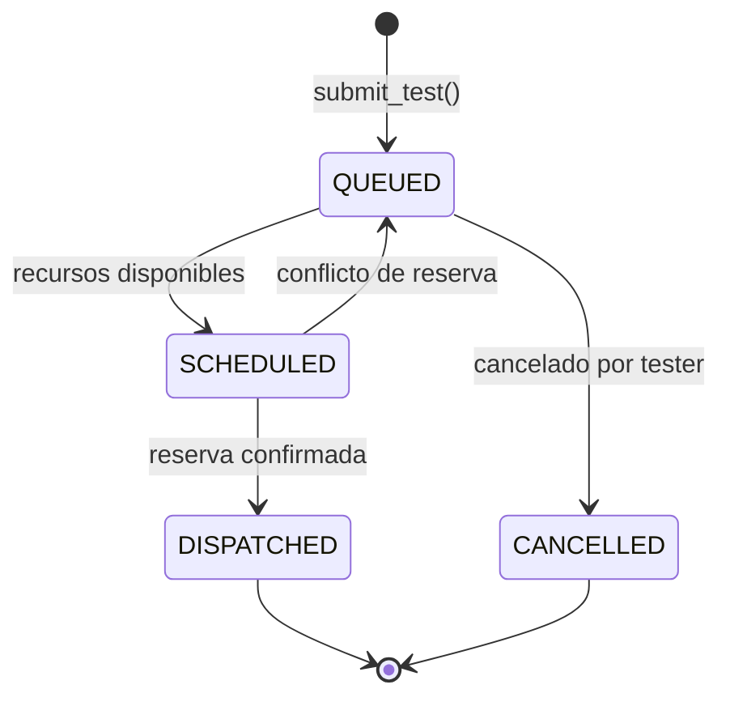

# Contextos Delimitados: Inventory · Reservation · Scheduling

# Contexto Delimitado: Inventory

## Descripción

Inventory es la fuente de verdad del hardware disponible en el entorno de testing. Gestiona el catálogo de switches físicos y sus capacidades técnicas. No sabe nada de reservas, pruebas ni ejecuciones; su único trabajo es responder: ¿qué switches existen y qué pueden hacer?

## Responsabilidades

- Registrar switches con sus especificaciones técnicas. (Serie, puertos, etc)
- Mantener el estado físico de cada dispositivo.
- Exponer una API de búsqueda filtrada por constraints técnicos.
- Notificar cambios de hardware al resto del sistema.

## Modelo del dominio

### Entidad principal: Switch

Un Switch en este contexto es un activo de hardware con capacidades técnicas. No es un endpoint de red ni un recurso reservable — eso lo decide Reservation.

```
Switch {
  id,
  hostname,
  plataforma,       
  firmware_version,
  soporte_poe,       
  numero_puertos,
  estado_fisico,     
  ubicacion,
  switch_ip,
  hub_port,
  topología
}
```

## Eventos

### Eventos emitidos

| Evento | Descripción | Consumidores típicos |
|---|---|---|
| `SwitchRegistered` | Nuevo switch dado de alta en el inventario | Scheduling (amplía pool disponible) |
| `SwitchUpdated` | Cambio en specs o ubicación | Reservation (re-evalúa candidatos) |
| `SwitchRetired` | Switch retirado definitivamente del inventario | Reservation, Scheduling |
| `SwitchStateChanged` | Cambio de estado físico del dispositivo | Observability |

### Eventos consumidos

Inventory es principalmente productor. No depende de eventos de otros contextos para mantener su modelo; los cambios de estado llegan desde Power Management vía API directa.

## Diagramas

### Comunicación interna



### Comunicación con otros contextos



## Resumen

| Aspecto | Detalle |
|---|---|
| **Responsabilidad** | Catálogo de hardware: qué switches existen y qué capacidades tienen |
| **Entidad central** | Switch con specs técnicas y estado físico |
| **Comunicación** | Expone API de búsqueda por constraints; emite eventos de cambio de inventario |
| **Independencia** | No conoce reservas, pruebas ni control de energía |

---

# Contexto Delimitado: Reservation

## Descripción

Reservation es el administrador de la concurrencia. Gestiona la asignación exclusiva de switches a un test durante una ventana de tiempo, garantizando que ningún otro proceso pueda usar el mismo recurso simultáneamente. Para este contexto, un switch no es un dispositivo con specs — es un slot de tiempo disponible o no.

## Responsabilidades

- Asignar switches a un test de forma exclusiva.
- Prevenir conflictos entre tests concurrentes.
- Gestionar expiración y liberación de reservas.
- Notificar al resto del sistema cuándo se crean o liberan reservas.


## Modelo del dominio

### Entidad principal: Reservation

Una Reservation en este contexto es un contrato de uso exclusivo. No le importa el firmware del switch ni la topología del test — solo *quién tiene qué y hasta cuándo*.

```
Reservation {
  id,
  testId,
  switchIds[],      // lista de switches reservados
  estado,           // PENDING | ACTIVE | RELEASED | EXPIRED
  creadaEn,
  expiraEn,
  liberadaEn
}
```

## Eventos

### Eventos emitidos

| Evento | Descripción | Consumidores típicos |
|---|---|---|
| `ReservationCreated` | Switches asignados exitosamente a un test | Power Management (encender devices), Observability |
| `ReservationReleased` | Reserva liberada al finalizar o cancelar un test | Power Management (apagar devices), Scheduling |
| `ReservationExpired` | Reserva expirada por timeout | Scheduling (re-encolar test), Observability |

### Eventos consumidos

| Evento | Origen | Uso en Reservation |
|---|---|---|
| `TestCompleted` / `TestFailed` | Test Execution | Disparar liberación de la reserva |
| `SwitchRetired` | Inventory | Invalidar reservas activas sobre ese switch |

## Diagramas

### Flujo de estados de una reserva



### Comunicación con otros contextos



## Resumen

| Aspecto | Detalle |
|---|---|
| **Responsabilidad** | Asignación exclusiva de switches; prevención de conflictos |
| **Entidad central** | `Reservation` con ventana de tiempo y lista de switches bloqueados |
| **Comunicación** | Recibe solicitudes de Scheduling; emite eventos a Power Management |
| **Modelo del switch** | Solo un ID y disponibilidad — no le importan sus specs |

---

# Contexto Delimitado: Scheduling

## Descripción

Scheduling gestiona la cola de tests pendientes y decide el orden de ejecución cuando los recursos no están disponibles de inmediato. Es el punto de entrada del sistema: recibe la intención del tester, coordina con Inventory y Reservation, y despacha el test a ejecución en el momento correcto.

## Responsabilidades

- Recibir y encolar solicitudes de tests.
- Consultar Inventory para encontrar switches compatibles.
- Solicitar reservas a Reservation cuando hay recursos disponibles.
- Priorizar y ordenar la cola de tests pendientes.
- Despachar tests a Test Execution una vez confirmada la reserva.

## Modelo del dominio

### Entidad principal: TestRequest

Una **TestRequest** en este contexto es la intención de un tester, traducida a constraints evaluables. No es el test en ejecución.

```
TestRequest {
  id,
  testerId,
  requisitos: {
    firmwareMinimo,
    requierePoe,
    topologia,
    plataforma
  },
  prioridad,        
  estado,           
  creadaEn,
  reservationId    
}
```

## Eventos

### Eventos emitidos

| Evento | Descripción | Consumidores típicos |
|---|---|---|
| `TestQueued` | Nueva solicitud ingresada a la cola | Observability |
| `TestDispatched` | Test enviado a ejecución con reserva confirmada | Test Execution, Observability |
| `TestCancelled` | Solicitud cancelada antes de despacho | Reservation (liberar si aplica), Observability |

### Eventos consumidos

| Evento | Origen | Uso en Scheduling |
|---|---|---|
| `ReservationReleased` | Reservation | Re-evaluar cola: puede haber tests esperando esos recursos |
| `ReservationExpired` | Reservation | Re-encolar el test afectado |
| `SwitchRegistered` | Inventory | Nuevo hardware disponible; re-evaluar cola |

## Diagramas

### Flujo de una solicitud



### Flujo de estados de una solicitud



## Resumen

| Aspecto | Detalle |
|---|---|
| **Responsabilidad** | Cola de tests, priorización y despacho a ejecución |
| **Entidad central** | `TestRequest` con requisitos técnicos, prioridad y estado |
| **Comunicación** | Consulta Inventory, solicita a Reservation, despacha a Execution |
| **Valor clave** | Evita que tests esperen indefinidamente o generen conflictos de recursos |
