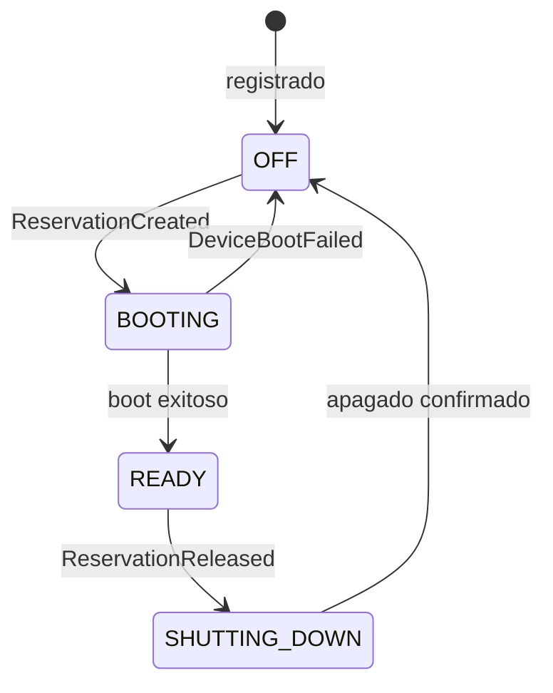
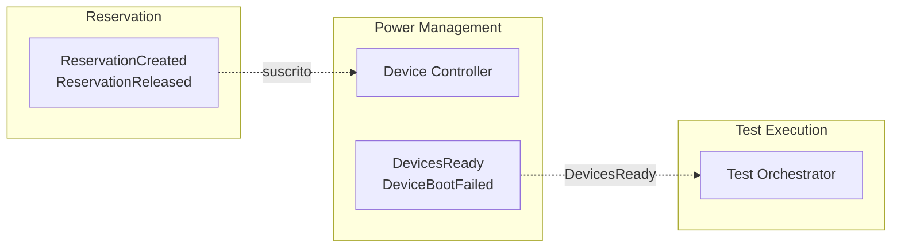
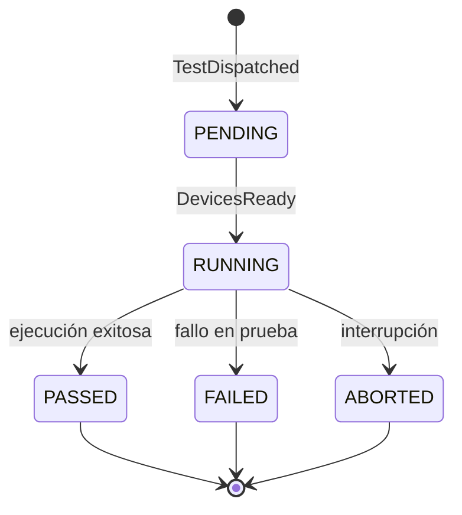
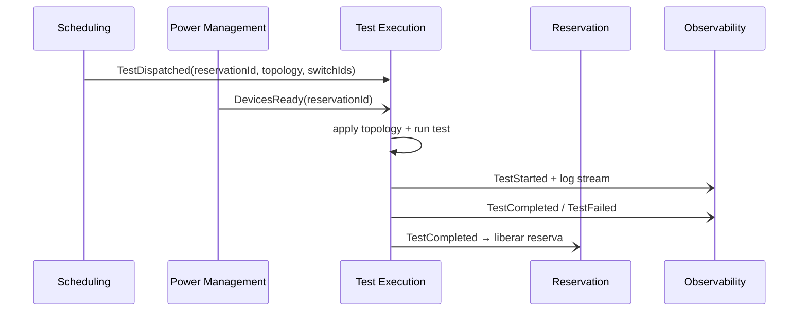
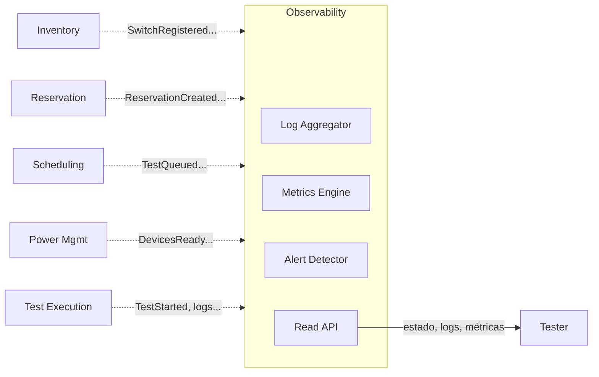
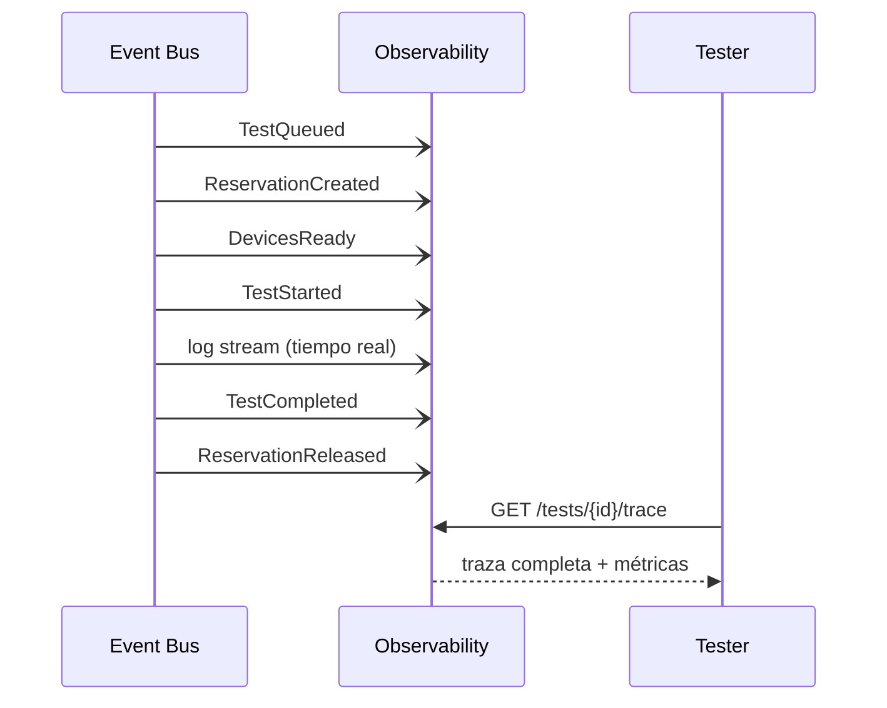

# Contextos Delimitados: Power Management · Test Execution · Observability

# Contexto Delimitado: Power Management

## Descripción

Power Management controla el ciclo energético de los dispositivos físicos. Se encarga de encenderlos cuando son necesarios y apagarlos al liberar una reserva, optimizando el consumo del entorno de testing. Para este contexto, un switch no es un recurso reservable ni un activo de inventario — es un endpoint de control de energía.

## Responsabilidades

- Encender switches al confirmarse una reserva.
- Validar que los dispositivos completaron el boot antes de notificar disponibilidad.
- Apagar dispositivos al liberarse una reserva o por inactividad.
- Manejar secuencias de arranque específicas por topología.

## Modelo del dominio

### Entidad principal: DevicePowerState

Un DevicePowerState representa el estado energético de un switch en un momento dado. No tiene specs técnicas ni información de reserva — solo sabe si el dispositivo está encendido, apagado o en proceso.

```
DevicePowerState {
  switchId,
  estado,           // OFF | BOOTING | READY | SHUTTING_DOWN
  ultimaAccion,     // POWER_ON | POWER_OFF
  ultimoCambio,
  reservationId     // contexto de por qué está encendido
}
```

## Eventos

### Eventos emitidos

| Evento | Descripción | Consumidores típicos |
|---|---|---|
| `DevicePoweredOn` | Un switch completó el encendido | Observability |
| `DevicesPoweredOff` | Switches apagados tras liberar reserva | Observability |
| `DevicesReady` | Todos los switches de una reserva están operativos | Reservation, Scheduling |
| `DeviceBootFailed` | Un switch no completó el arranque | Reservation (invalida reserva), Observability |

### Eventos consumidos

| Evento | Origen | Uso en Power Management |
|---|---|---|
| `ReservationCreated` | Reservation | Iniciar secuencia de encendido |
| `ReservationReleased` | Reservation | Iniciar secuencia de apagado |
| `ReservationExpired` | Reservation | Apagar dispositivos sin test activo |

## Diagramas

### Ciclo de vida energético de un device



### Comunicación con otros contextos



## Resumen

| Aspecto | Detalle |
|---|---|
| **Responsabilidad** | Ciclo energético de dispositivos: encendido, boot, apagado |
| **Entidad central** | `DevicePowerState` con estado del ciclo ON/OFF por switch |
| **Comunicación** | Suscrito a eventos de Reservation; emite `DevicesReady` a Execution |
| **Valor clave** | Desacopla la lógica de hardware del flujo de reserva y ejecución |

---

# Contexto Delimitado: Test Execution

## Descripción

**Test Execution** orquesta la ejecución de una prueba sobre los switches reservados. Recibe el despacho de Scheduling con una reserva confirmada y dispositivos listos, aplica la topología, ejecuta el test y reporta el resultado. Para este contexto, un switch es un **endpoint de red al que conectarse** — no un activo de inventario ni un recurso en cola.

## Responsabilidades

- Recibir y ejecutar tests despachados por Scheduling.
- Aplicar la topología de red sobre los switches asignados.
- Gestionar el ciclo de vida del test: inicio, progreso, finalización.
- Transmitir logs en tiempo real a Observability.
- Notificar el resultado final al resto del sistema.

## Modelo del dominio

### Entidad principal: TestJob

Un **TestJob** es la prueba en ejecución. Contiene lo necesario para correr y nada más — no gestiona colas ni reservas.

```
TestJob {
  id,
  testRequestId,    // referencia al origen en Scheduling
  reservationId,    // referencia a los switches asignados
  topologia,
  switchIds[],
  estado,           // PENDING | RUNNING | PASSED | FAILED | ABORTED
  iniciadoEn,
  finalizadoEn,
  resultado         // PASS | FAIL | ERROR
}
```

## Eventos

### Eventos emitidos

| Evento | Descripción | Consumidores típicos |
|---|---|---|
| `TestStarted` | El test comenzó la ejecución | Observability |
| `TestCompleted` | Test finalizado con resultado exitoso | Reservation (liberar), Observability |
| `TestFailed` | Test finalizado con fallo | Reservation (liberar), Observability |
| `TestAborted` | Test interrumpido manualmente o por error crítico | Reservation (liberar), Scheduling, Observability |

### Eventos consumidos

| Evento | Origen | Uso en Test Execution |
|---|---|---|
| `TestDispatched` | Scheduling | Crear y encolar el TestJob |
| `DevicesReady` | Power Management | Iniciar la ejecución del test |

## Diagramas

### Flujo de estados de un test



### Comunicación con otros contextos



## Resumen

| Aspecto | Detalle |
|---|---|
| **Responsabilidad** | Orquestar ejecución del test sobre switches asignados |
| **Entidad central** | `TestJob` con topología, switches, estado y resultado |
| **Comunicación** | Recibe de Scheduling y Power Mgmt; emite resultado a Reservation y Observability |
| **Modelo del switch** | Endpoint de red — solo importa su IP/hostname para conectarse |

---

# Contexto Delimitado: Observability

## Descripción

Observability es el consumidor de eventos de todo el sistema. Agrega logs, métricas y estados de todos los contextos para dar visibilidad global sin interferir en el flujo principal. Es un contexto read-only: escucha, almacena y expone — nunca escribe en otros contextos ni participa en decisiones de negocio.

## Responsabilidades

- Centralizar logs de ejecución por test y por dispositivo.
- Agregar métricas de utilización de hardware y duración de pruebas.
- Exponer estados en tiempo real para el tester durante la ejecución.
- Detectar y alertar ante situaciones anómalas (recursos bloqueados, tests lentos, fallos repetidos).

## Modelo del dominio

### Entidades principales

Observability mantiene proyecciones derivadas de eventos — no tiene entidades de negocio propias.

```
LogEntry {
  id,
  testJobId,
  switchId,         // opcional
  timestamp,
  nivel,            // INFO | WARN | ERROR
  mensaje
}

TestMetric {
  testJobId,
  duracionMs,
  resultado,        // PASS | FAIL
  switchesUsados,
  timestamp
}
```

## Eventos

### Eventos emitidos

| Evento | Descripción | Consumidores típicos |
|---|---|---|
| `AlertRaised` | Anomalía detectada (timeout, fallo repetido, recurso bloqueado) | Tester (notificación), sistemas externos |

### Eventos consumidos

Observability se suscribe a **todos** los eventos del sistema:

| Evento | Origen |
|---|---|
| `TestQueued`, `TestDispatched`, `TestCancelled` | Scheduling |
| `ReservationCreated`, `ReservationReleased`, `ReservationExpired` | Reservation |
| `DevicePoweredOn`, `DevicesReady`, `DeviceBootFailed`, `DevicesPoweredOff` | Power Management |
| `TestStarted`, `TestCompleted`, `TestFailed`, `TestAborted` | Test Execution |
| `SwitchRegistered`, `SwitchStateChanged` | Inventory |

## Diagramas

### Posición en el sistema



### Construcción de la traza de un test



## Resumen

| Aspecto | Detalle |
|---|---|
| **Responsabilidad** | Visibilidad global: logs, métricas y alertas sin participar en el flujo |
| **Entidad central** | `LogEntry` y `TestMetric` — proyecciones derivadas de eventos |
| **Comunicación** | Solo consume eventos; expone API de lectura para el tester |
| **Principio clave** | Read-only consumer — nunca escribe ni decide en otros contextos |
