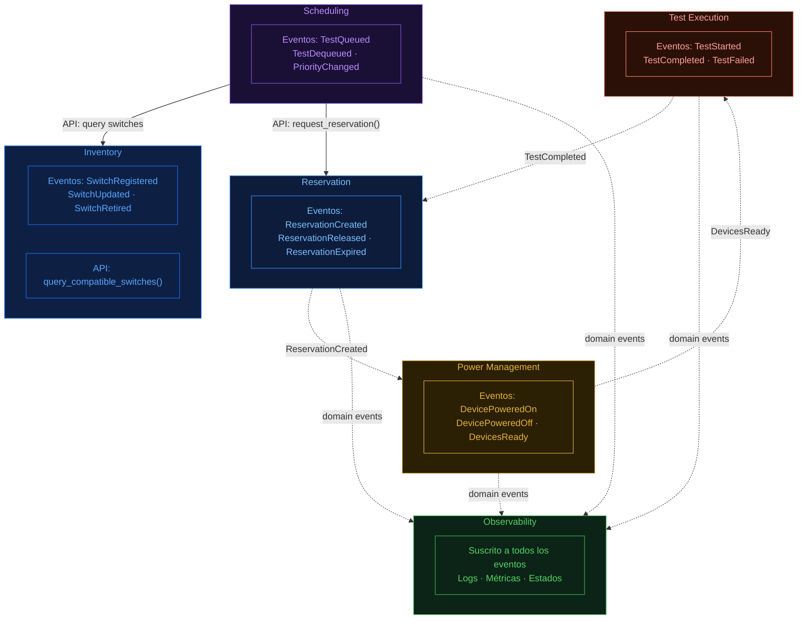
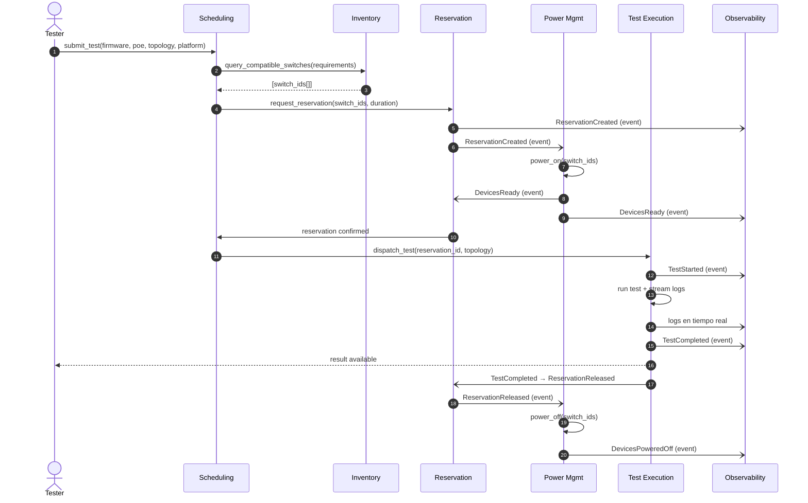

# Switch Testbed Reservation System

## Descripción

En un entorno real de testing de redes, los ingenieros suelen enfrentarse a un proceso altamente manual y poco eficiente. Antes de ejecutar una prueba, deben buscar switches disponibles, verificar que cumplan con los requisitos técnicos (como versión de firmware, soporte de PoE o tipo de plataforma), configurar manualmente la topología y coordinar el uso de recursos con otros testers para evitar conflicto.

Este flujo de trabajo no solo consume tiempo, sino que también es propenso a errores humanos y difícil de escalar cuando múltiples pruebas deben ejecutarse de forma concurrente, en un hardware límitado.

El Management Switch Reservation System surge como una solución a este problema, proporcionando una plataforma centralizada que automatiza completamente este proceso. Desde la perspectiva del tester, la interacción con el sistema es simple: únicamente debe definir un test especificando sus requisitos técnicos del test, como:
- Necesidad de PoE
- Versión requerida de firmware
- Topología
- Tipo de plataforma

A partir de esta información, el sistema se encarga automáticamente de:
- Identificar switches compatibles
- Reservar los recursos necesarios
- Encender los dispositivos si es requerido
- Ejecutar la prueba de forma automatizada

Durante la ejecución, el usuario puede monitorear el progreso mediante logs en tiempo real y estados claros del test. Una vez finalizada la prueba, el sistema libera los recursos utilizados, puede apagar los dispositivos para optimizar energía y actualiza métricas que permiten analizar el rendimiento del entorno de testing.

Este enfoque permite resolver problemas clave, como conflictos entre testers o entre test automatizados, dificultad en el debbuging al ser muchas pruebas, optimizacion de los rescursos, ejecuciones fuera de supervisión humana.

---

## Funcionalidades

### Inventory
Indica el hardware disponible. Registra switches con sus specs técnicas (firmware, PoE, plataforma) y expone una API de búsqueda por constraints para que otros contextos consulten candidatos compatibles.
- Registro y actualización de switches
- Filtrado por requisitos técnicos
- Ciclo de vida del dispositivo (`AVAILABLE`, `RESERVED`, `POWERED_OFF`, `MAINTENANCE`)

### Reservation
Árbitro de la concurrencia. Asigna switches a un test de forma exclusiva, evitando que dos pruebas usen el mismo recurso simultáneamente.
- Asignación automática basada en disponibilidad
- Prevención de conflictos con bloqueo por tiempo
- Liberación automática al finalizar o expirar el test

### Scheduling
Gestiona la cola de pruebas pendientes cuando no hay recursos disponibles de inmediato. Decide el orden de ejecución según prioridad y tiempo de espera.
- Cola de tests con priorización configurable
- Re-intento automático al liberarse recursos
- Prevención de starvation para tests de baja prioridad

### Power Management
Controla el encendido y apagado de los dispositivos físicos. Optimiza el consumo energético apagando switches que no están en uso.
- Encendido secuencial con validación de boot
- Apagado automático al liberar una reserva
- Control de secuencias de arranque por topología

### Test Execution
Orquesta la ejecución de la prueba sobre los switches reservados. Aplica la topología, corre el test y reporta el resultado.
- Configuración automática de topología
- Estados del test: `PENDING`, `RUNNING`, `PASSED`, `FAILED`
- Streaming de logs en tiempo real durante la ejecución

### Observability
Consumidor de eventos de todos los contextos. Agrega logs, métricas y estados para dar visibilidad global del sistema sin acoplarse al flujo principal.
- Logs centralizados por test y por dispositivo
- Métricas de utilización de hardware y duración de pruebas
- Alertas ante fallos o recursos bloqueados por tiempo excesivo

---

## Diagrama de interacción entre contextos

## Flujo de eventos

